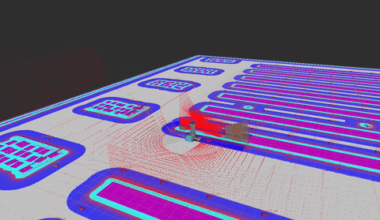
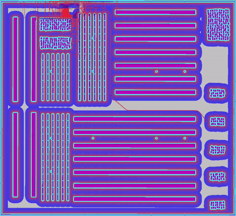
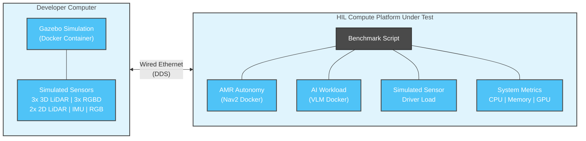
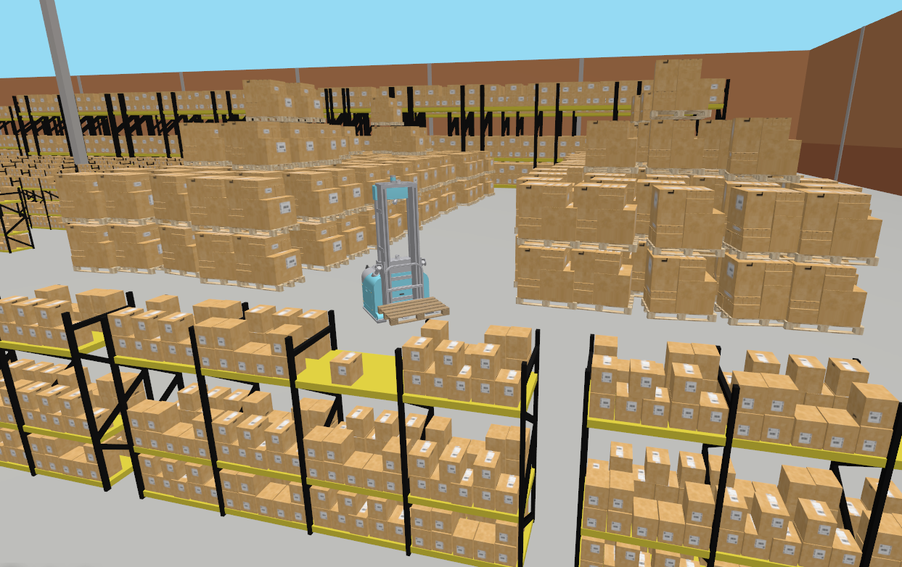
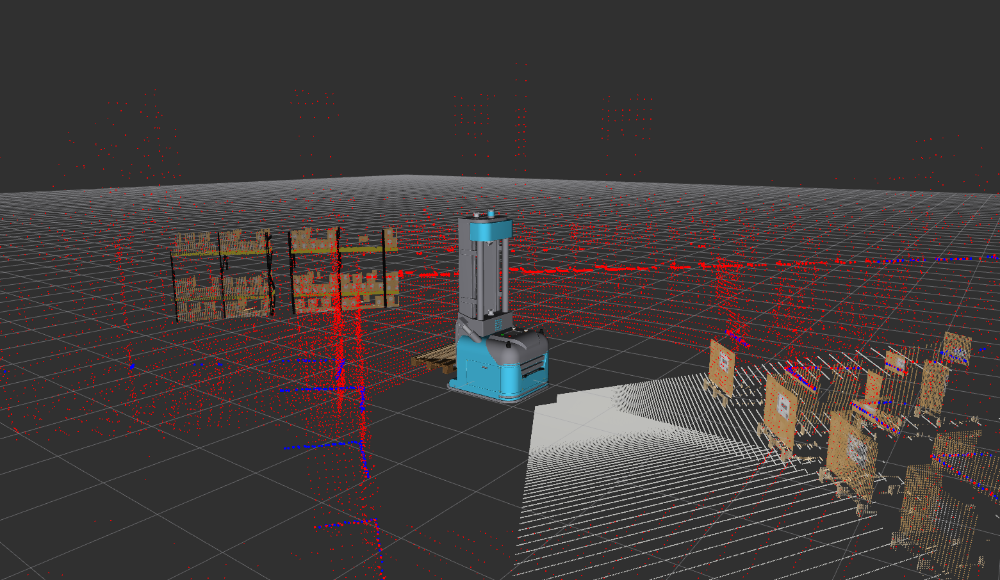

# Open Navigation's Robotics Workload Benchmark

This is a robotics and AI workload benchmark to compare various hardware platforms using realistically complex, data intensive, representative applications. Many benchmarks exist from both hardware vendors and community members, but nearly all focus on evaluating a particular component or algorithm in isolation. Often times, multiple of these algorithms need to be run together which may interact negatively when composed into a full system due to sharing of limited CPU or conflicts accessing accelerated computing resources (GPU, NPU, FPGA, etc).

This project aims to fill the gap by providing a reproducable, independent benchmark for comparing and evaluating compute solutions for Robotics or Physical AI applications in all of their complexity. For this benchmark, we use Nav2 to autonomously navigate a forklift material handling robot within a 200,000 sqft (18,600 m2) industrial warehouse environment with its advanced, built-in planning, control, behavior modeling, and perception. It will move pallets from shipping/receiving to shelving units while processing multiple 3D lidars, 2D safety lidars, RGBD cameras, and internal sensors. This workload is representative of dozens of companies and tens of thousands of robotics deployed today in production environments.

The benchmark also includes an (optional) Edge AI workload. We use Gemma 4.0, a popular VLM, to exercise the platforms' GPUs during the benchmark. We integrate it scene understanding in the navigation behavior tree to impact decision making. VLMs are intensive workloads robotics-targeted embedded platforms are being built with in mind, so its a good benchmark to fully leverage the capabilities of modern platforms.

This benchmark compares both system metrics as well as important performance analysis of the autonomous navigation and AI workload performance. It provides instructions and tools to run the pipeline yourself for a compute platform to validate the results or extend easily to include a new platform.

  
  

  Click on the gifs above to see the full length videos!

  ⚠️ Need ROS 2, Nav2 help or support? Contact Open Navigation! ⚠️

## Platforms Evaluated

The [Jetson AGX Orin](https://www.nvidia.com/en-us/autonomous-machines/embedded-systems/jetson-orin/) is NVIDIA's established embedded AI platform widely adopted in robotics which require edge AI such as detection, segmentation, and reinforcement learning. The Orin is the current workhorse of many production robotics deployments.

The [Jetson Thor](https://www.nvidia.com/en-us/autonomous-machines/embedded-systems/jetson-thor/) is NVIDIA's next-generation embedded AI module built on the Blackwell GPU architecture. Thor is designed as the next platform for physical AI and advanced robotics applications and enables edge AI such as LLM/VLM and foundation models.

The [AMD X100 (Strix Halo)](https://www.amd.com/en/products/processors/desktops/ryzen/ryzen-ai-halo.html) is AMD's flagship targeting AI and robotics edge workloads. Strix Halo represents an x86-based alternative to the Jetson ecosystem, offering strong CPU performance with unified memory for LLM/VLM workloads.

| Feature | Jetson AGX Orin | Jetson Thor | X100 / Strix Halo |
|---|---|---|---|
| **CPU** | 12x Arm Cortex-A78AE @ 2.2 GHz | 14x Arm Neoverse V3AE @ 2.6 GHz | 16x Zen 5 (32T) @ 5.1 GHz |
| **GPU Architecture** | Ampere | Blackwell | RDNA 3.5 |
| **GPU Cores** | 2048 CUDA + 64 Tensor | 2560 CUDA + 96 Tensor | 2560 Shaders (40 CUs) |
| **NPU / DLA** | 2x NVDLA 2.0 | DLA (105 INT8 TOPS) | XDNA 2 (50 TOPS) |
| **RAM** | 64 GB LPDDR5 | 128 GB LPDDR5X | Up to 128 GB LPDDR5X |
| **Memory Bandwidth** | 204.8 GB/s | 273 GB/s | 256 GB/s |
| **Power (TDP)** | 15–60 W | 40–130 W | 45–120 W |

## Architecture

The benchmark consists of a developer computer networked to the hardware platform being evaluated as the HIL computer.
The developer computer will run a simulation engine in a provided docker container to simulate a large scale warehouse environment and the robot's sensors.
This is run on another machine to isolate potential effects from resource scheduling the simulation on utilization metrics. 
DDS is configured to only operate on the wired ethernet interface to minimize the impacts due to discover traffic or other interference. 

The compute platform being benchmarked will then run a benchmark script which will launch the AMR autonomy and (optional) AI workloads, along with a light weight script which will measure system metrics like CPU, memory, and GPU utilization.
To simulate the affects of hardware driver interfaces on the compute landscape, an additional script will run to simulate the load from sensor drivers on the platform.
The CPU load on each is determined by measuring the real-world average utilization metrics running Realsense D435 and Ouster OS-1 drivers on each platform. 
Other sensors such as the Orbecc Gemini 355 and Hesai XT32 are measured to be similar.

All logs from the workflows and system metrics capture are saved in `opennav_benchmark_logs` for later analysis.
`opennav_benchmark_analysis` provides automated tools to visualize and extract key metrics from a single platform's run or compare and contrast multiple platforms at once.

## Simulation

The simulation is set up as a representatively complex and data intensive workload of a modern robotics application. It simulates a full 200,000 sqft industrial warehouse facility with loading docks, block stacking, long aisles, and blocked aisles due to simulated accident scenes. Larger simulations are absolutely possible, however we chose to limit it to what can be run on laptop processors from the last ~3 years to make this more accessible. For higher quality simulation and/or expanding the world size, see the `opennav_benchmark_pipeline` README for more instructions.

  

The robot simulated is an autonomous differential-drive forklift platform holding a pallet in its forks containing:
* 3x 3D LIDARs (10 Hz, 30m range, 32 beams @ 512 resolution)
* 3x RGBD cameras (10 Hz, 320x240 resolution)
* 2x 2D Safety LIDARs (30 Hz, 25m range)
* 1x RGB camera (5 Hz, 640x480 resolution)
* 1x IMU (100 Hz)

The robot has a maximum speed of 2 m/s.

  

## Robotic & AI Workloads

A mission dispatcher will send the forklift from its charging dock to pick up a pallet either in the block stack or loading dock area and drop it at a shelf in the long-term storage racks. The BT Navigator accepts these missions and executes the configurable beahvior tree describing the navigation behavior to perform. This will repeat indefinitely for the duration of the benchmark run, except every 200 pick-and-place missions the robot will return to the charging dock and dock before continuing. A 10 second wait is enacted while picking or placing to simulate downtime due to picking or placing the pallet. 

Nav2 will perform autonomous navigation path planning using the kinematically feasible Hybrid-A* planning algorithm across the warehouse-sized space. This uses the full footprint of the vehicle to do SE2 collision checking to ensure collision free and drivable paths for non-circular vehicles. It also uses the MPPI controller, an optimization based controller which can both accurately track paths, align with precise goal positions, as well as dynamically adjust off the path to provide more margin from obstacles or perform complex maneuvers in confined environments.

The robotic AMR workload will then process 9/10 of the sensors above. The RGB camera is neglected and is used by the AI workload only. The 3D lidars are processed by the Spatio-Temporal Voxel Layer, the standard solution for 3D lidars which maintains a spatio-temporal representation of the environment clearing using frustum modeling. The 2D lidars and RGBD cameras are processed by the obstacle and voxel layers, respectively, which use raycasting to clear out free space.

In addition, Nav2 performs velocity smoothing and collision monitoring using the controller's outputs to ensure dynamic feasibility and collision-free navigation with raw sensor data as a psuedo-safety layer. Localization is provided by odometry from the simulation as well as AMCL particle filtering.

The AI workload exposes a VLM server which is regularly queried by the behavior tree to provide scene understanding or contextual information to impact decision making and algorithm settings or selection. While VLMs could be leveraged in a number of ways in an application, the frequent queries to the VLM provide a regularized workload for benchmark measurements which is advantageous for a fair and consistent result. Other applications of VLMs would call them irregularly as-needed. 

The VLM server subscribes to the RGB camera topic mounted on the chassis of the robot in a strategic location with good visibility of the scene in the primary direction of travel. Queries are then made in the behavior tree to understand context about the scene, such as detecting unusual obstacles, crowds, and hazards to successful task completion. If any such hazards are found, the robot is directed down another route to the goal. If humans are detected in the scene, the maximum velocity is reduced.

## Results and Comparison

TODO graphs, high-level metircs, and log-based analysis 

## Independent Reproduction, Extension to New Platforms

See the instructions in the `opennav_benchmark_pipeline` for building and running the benchmark.
The pipeline provides Dockerfiles for the simulation, AMR Robot workload, and AI workloads which can be run to reproduce the benchmark.

If you wish to add your own platform, simply:
* Update the `hardware_platforms.py` to capture the system metrics for your particular platform 
* Update `detect_platform()` to add the new platform to the detection schema
* Provide an appropriate `HARDWARE_PROFILES` which corresponds to your sensor driver load on the platform for each representative sensor
* Create the `ai_workload` Dockerfile and `profiles.sh` to launch `ggml-org/gemma-4-31B-it-GGUF:Q4_K_M`

If you end up doing so, consider opening a PR with your modifications and provide the data & analysis for your platform so others can learn from it!

Happy benchmarking :-) 